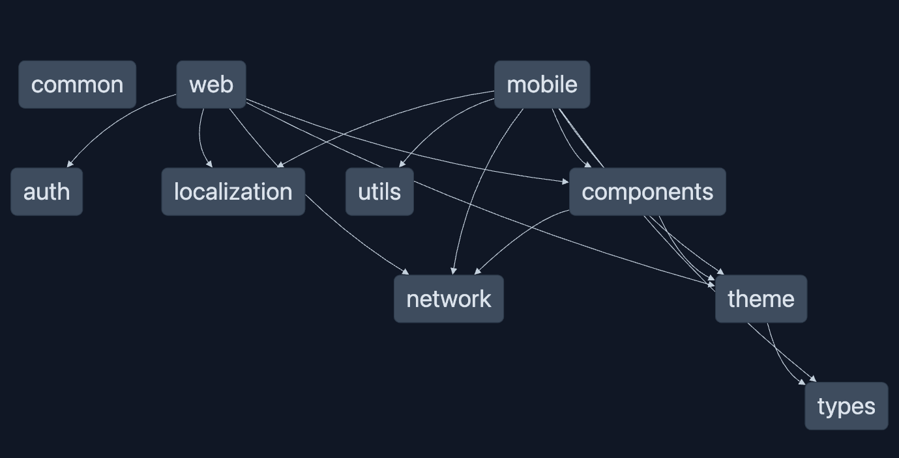
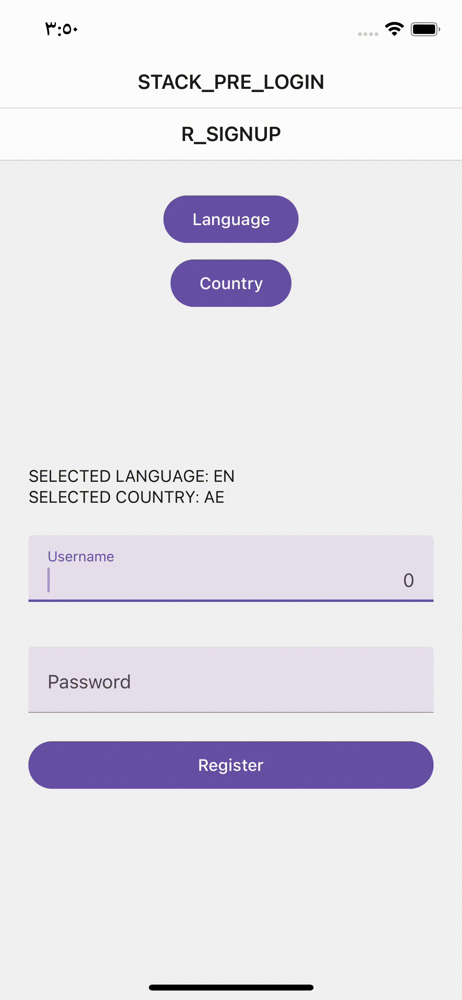
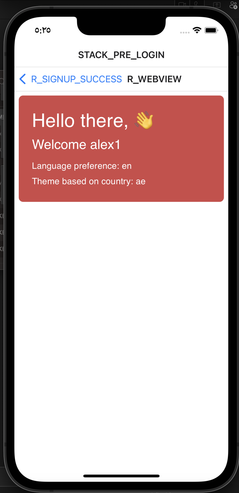
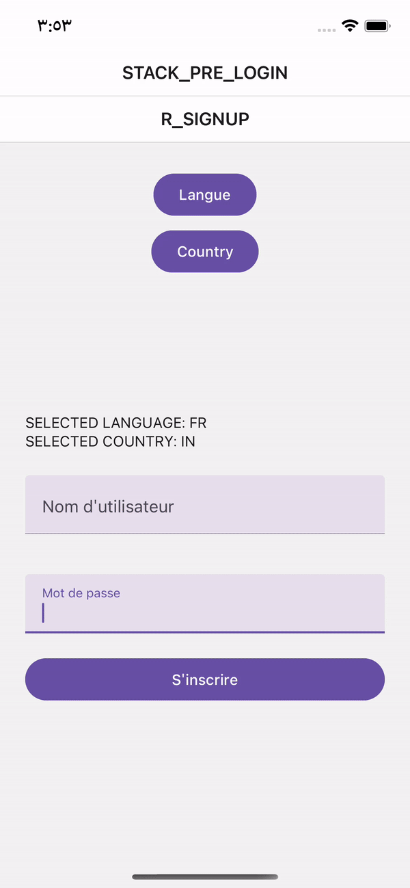
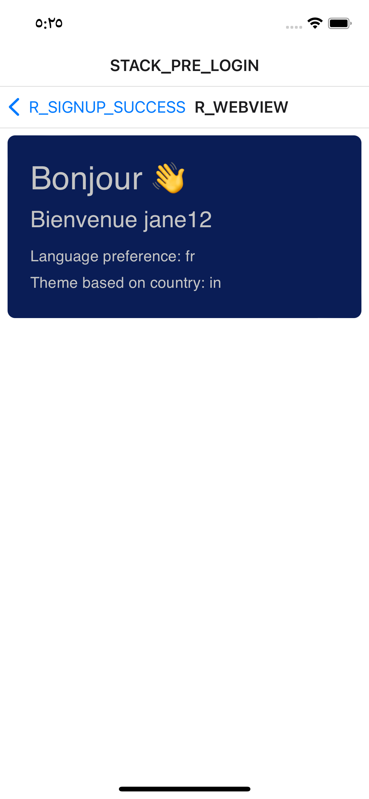

# AssmtApp

Monorepo with - web(React) & mobile(React Native) apps with shared libs/modules for maximum re-usabilty within and across the apps in the project.

### Highlights

- Credentials are encrypted and stored/retrieved securely on mobile device
- Localization supporting 4 languages
- Country support UAE and India with country specific validation rules and themes on post login dashboard.
- Features are modular with no cross module dependency
- Component library for web & mobile as a lib in the project so that more apps can be added to the project and libraries can be utilized
- Country specific feature config - changes expected to happen in different countries such as validation rules and microservice are moved to a country specific config, so that same feature can work for multiple countries with minimal change in config. 

## Project graph



### Structure

```
assmt-app
- apps
  - mobile
    - env
        - in
        - ae
    - src
    - features
      - signup
      - dashboard
  - web
    - features
      - signin
      - dashboard
- libs
  - common // Common logics and business rules to be used across the apps
  - auth
  - components
    - mobile
    - web
  - localization
  - network
  - theme 
  - types
  - utils // Encryption and other  re-usable utils
```

## Pre-requisites

node > 18 <br />
yarn

## Getting started

Clone the project

```
git clone https://github.com/jacob-san/assmt-app.git
cd assmt-app
```

Install dependencies

```
yarn
```

### Start the app

To start the mobile app

```
yarn nx run run-ios
```

To start the app with AE country config and uat config

```
yarn ios:ae:uat
```

To start the web app

```
yarn nx run web:serve
```

## Demo

### Demo - language selected is English & country is UAE

<div style="display: 'inline-block'">


</div>


### Demo - language selected is French & country is India

<div style="display: 'inline-block'">


</div>